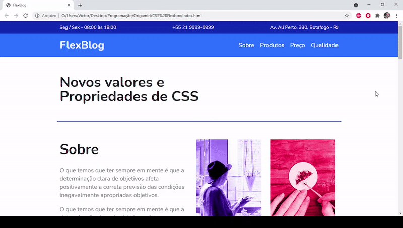

<h1 align="center">CSS FlexBlog</h1>

<p align="center">Landing Page desenvolvida no curso de Flexblox da Origamid.</p>

<p align="center">
  
</p>

### 🛠️ Tecnologias

- [HTML](https://developer.mozilla.org/pt-BR/docs/Web/HTML)

### 🔽 Clonando o repositório
```bash
$ git clone https://github.com/victorsantss/CSS-Flexbox.git
```

### 🖥️ Iniciando a aplicação

-Abra o arquivo index.html
